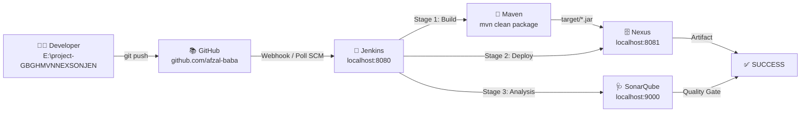

# 🚀 GBGHMVNNEXSONJEN - Enterprise DevOps CI/CD Pipeline

<div align="center">

[](https://github.com/afzal-baba/project-GBGHMVNNEXSONJEN)
[](https://maven.apache.org/)
[](https://openjdk.org/)
[](http://localhost:8081)
[](http://localhost:9000)
[](https://github.com/afzal-baba/project-GBGHMVNNEXSONJEN)

> **From Zero to DevOps Hero on Windows 11** <br/>
> **Full DevOps Lifecycle: GitHub | Maven | Nexus | SonarQube | Jenkins**

[📥 Download PDF Guide](#) | [🏗️ Architecture](#️-architecture) | [🛠️ Setup](#️-tech-stack--installation) | [🚀 Quick Start](#-quick-start)

</div>

---

## 🌟 What is GBGHMVNNEXSONJEN? (Kid-Friendly Story)

Imagine you have a **Toy Factory** 🧸

| Letter | Tool | Meaning | Kid Analogy |
| :---: | :---: | :---: | :---: |
| **G** | **GitHub** | Source Code Management | 📚 Drawing Book - keeps drawings safe |
| **B & M** | **Maven** | Build Automation | 🔨 Builder Machine - makes real toy from drawing |
| **N** | **Nexus** | Artifact Repository | 🗄️ Big Shelf - stores all finished toys |
| **SON** | **SonarQube** | Code Quality & Security | 🩺 Doctor - checks if toy is broken/safe |
| **JEN** | **Jenkins** | CI/CD Orchestration | 🤖 Boss Robot - tells everyone what to do |

**Flow in Simple Words:**
```
You Draw (code) -> Put in Book (GitHub) -> Boss Robot (Jenkins) sees new drawing -> Shouts BUILD! -> Builder Machine (Maven) builds Toy (JAR) -> Puts on Shelf (Nexus) -> Doctor (SonarQube) checks -> SUCCESS! ✅
```

---

## 🏗️ Architecture



**3-Stage Pipeline (Jenkinsfile):**
1.  **Build** - `mvn clean package -DskipTests` -> Creates JAR
2.  **Deploy to Nexus** - `mvn deploy` -> Uploads JAR to `http://localhost:8081/repository/maven-snapshots/`
3.  **SonarQube Analysis** - `mvn sonar:sonar` -> Quality report at `http://localhost:9000`

---

## 🛠️ Tech Stack & Installation (Windows 11)

| Tool | Version | Install Location | URL / Purpose |
| :---: | :---: | :--- | :--- |
| **Java (JDK)** | 21 | `C:\devops\java\jdk-21` | Electricity for all tools |
| **Maven** | 3.9.14 | `E:\maven\apache-maven-3.9.14` | Build Tool |
| **Maven Settings** | - | `C:\Users\%USERNAME%\.m2\settings.xml` | Secret password for Nexus |
| **Nexus** | 3.x OSS | `C:\devops\nexus` | Artifact Shelf |
| **SonarQube** | 10.x Community | `C:\devops\sonarqube` | Code Doctor |
| **Jenkins** | 2.x | `C:\ProgramData\Jenkins\.jenkins` | Boss Robot |
| **Git** | Latest | `C:\Program Files\Git\bin\git.exe` | Version Control |
| **Project** | 1.0-SNAPSHOT | `E:\project-GBGHMVNNEXSONJEN` | Main Factory |

### 🔧 Environment Variables (Windows)
```bash
JAVA_HOME = C:\devops\java\jdk-21
M2_HOME = E:\maven\apache-maven-3.9.14
MAVEN_HOME = E:\maven\apache-maven-3.9.14
Path Add -> %JAVA_HOME%\bin , %M2_HOME%\bin

Verify:
java -version  -> openjdk 21
mvn -version   -> Apache Maven 3.9.14
```

---

## 📁 Project Structure - Treasure Map

```
E:\project-GBGHMVNNEXSONJEN\
├── 📄 pom.xml                          # Recipe Book + Nexus address
├── 📄 Jenkinsfile                      # Boss Robot's To-Do List (3 stages)
├── 📄 README.md                        # This colorful board
├── 📄 .gitignore                       # Ignore trash files
├── 📂 src/main/java/com/gbghmvnnexsonjen/
│   └── 📄 App.java                     # Toy Drawing - Hello World!
├── 📂 target/                          # Built toys go here
│   └── 📦 project-GBGHMVNNEXSONJEN-1.0-SNAPSHOT.jar  # FINAL TOY!
└── 📂 .git/                            # Invisible history book
```

**Other Important Locations:**
- **Maven Settings (Secret Key):** `C:\Users\AFZALBABA\.m2\settings.xml`
- **Jenkins Workspace (Work Table):** `C:\ProgramData\Jenkins\.jenkins\workspace\GBGHMVNNEXSONJEN`
- **Jenkins Home (Brain):** `C:\ProgramData\Jenkins\.jenkins`

---

## ⚡ Quick Start (Git Bash - Copy Paste)

Open **Git Bash** in `E:\` and paste:

```bash
# Clone
git clone https://github.com/afzal-baba/project-GBGHMVNNEXSONJEN.git
cd project-GBGHMVNNEXSONJEN

# Build (makes JAR)
mvn clean package
# Output: target/project-GBGHMVNNEXSONJEN-1.0-SNAPSHOT.jar  -> BUILD SUCCESS

# Deploy to Nexus Shelf
mvn deploy -DskipTests
# Uploads to http://localhost:8081

# SonarQube Doctor Check
mvn org.sonarsource.scanner.maven:sonar-maven-plugin:5.0.0.4389:sonar   -Dsonar.projectKey=project-GBGHMVNNEXSONJEN   -Dsonar.host.url=http://localhost:9000   -Dsonar.token=sqp_YOUR_REAL_TOKEN

# Git Push
git add .
git commit -m "Update"
git push origin main
```

---

## 🐛 Errors We Faced & How We Fixed (Detective Story)

| # | Error | Kid Meaning | Fix |
| :---: | :--- | :--- | :--- |
| **1** | `pom.xml not found` | You are cooking outside kitchen! | `cd /e/project-GBGHMVNNEXSONJEN` then `mvn clean package` |
| **2** | `Failed to connect to repository` | GitHub book is locked, need key | Generate PAT `ghp_xxx` on GitHub -> Jenkins -> Credentials -> Username with password |
| **3** | `CreateProcess error=87 Cannot run program ""` | Boss robot doesn't know where hammer is! | **Manage Jenkins -> Tools -> Git installations -> Path: `C:\Program Files\Git\bin\git.exe`** |
| **4** | `401 Unauthorized SonarQube` | Doctor says "Who are you?" | Use REAL token from `http://localhost:9000 -> My Account -> Security` not fake `sqp_YOUR_TOKEN` |
| **5** | `sonar.organization missing` | Using SonarCloud token on local SonarQube | Use token from `localhost:9000` only, not `sonarcloud.io` |
| **6** | `Branch master not found` | GitHub now uses `main` not `master` | Jenkins -> Branches to build -> `*/main` |
| **7** | `Updates rejected fetch first` | Your notebook is old, friend has new | `git pull origin main --rebase` then `git push` OR `git push --force` |
| **8** | `mode 160000 nested folder` | Box inside same box! | `rm -rf nested_folder && git rm --cached nested_folder` |

---

## ✅ Final Verification - After BUILD SUCCESS

- **Jenkins:** http://localhost:8080/job/GBGHMVNNEXSONJEN/ -> Last build GREEN ✅
- **Nexus:** http://localhost:8081 -> Browse -> `maven-snapshots` -> `com/gbghmvnnexsonjen/project-GBGHMVNNEXSONJEN/1.0-SNAPSHOT/` -> JAR exists! 📦
- **SonarQube:** http://localhost:9000/dashboard?id=project-GBGHMVNNEXSONJEN -> Quality Gate PASSED 🩺
- **Local JAR:** `E:\project-GBGHMVNNEXSONJEN\target\project-GBGHMVNNEXSONJEN-1.0-SNAPSHOT.jar`

---

## 🎤 Interview Story (30 Sec)

> "I built an end-to-end CI/CD pipeline on Windows 11 from scratch. I installed and configured Java 21, Maven 3.9.14, Nexus as artifact repository at 8081, SonarQube at 9000 for quality gate, and Jenkins at 8080 as orchestrator. I created a Maven project with distributionManagement pointing to Nexus, configured settings.xml with credentials, wrote a 3-stage declarative Jenkinsfile (Build, Deploy to Nexus, Sonar Analysis). I pushed code to GitHub, configured Jenkins SCM with GitHub PAT token, fixed critical errors like Git tool path error 87, Sonar 401 by using local token from localhost:9000, resolved branch main vs master and git rebase issues. Final pipeline is GREEN, JAR is deployed to Nexus snapshots, and SonarQube report shows Quality Gate PASSED."

---

## 📜 Jenkinsfile

```groovy
pipeline {
    agent any
    tools { jdk 'jdk21'; maven 'maven3' }
    stages {
        stage('Build') {
            steps { bat 'cd /d E:\project-GBGHMVNNEXSONJEN && mvn clean package -DskipTests' }
        }
        stage('Deploy to Nexus') {
            steps { bat 'cd /d E:\project-GBGHMVNNEXSONJEN && mvn deploy -DskipTests' }
        }
        stage('SonarQube Analysis') {
            steps { bat 'cd /d E:\project-GBGHMVNNEXSONJEN && mvn org.sonarsource.scanner.maven:sonar-maven-plugin:5.0.0.4389:sonar -Dsonar.projectKey=project-GBGHMVNNEXSONJEN -Dsonar.host.url=http://localhost:9000 -Dsonar.token=sqp_YOUR_REAL_TOKEN -Dsonar.scanner.skipJreProvisioning=true' }
        }
    }
}
```

---

## 👨‍💻 Author & Links

**afzal-baba** 
- GitHub: [@afzal-baba](https://github.com/afzal-baba)
- Repo: [project-GBGHMVNNEXSONJEN](https://github.com/afzal-baba/project-GBGHMVNNEXSONJEN)

**Useful URLs:**
- GitHub Code: https://github.com/afzal-baba/project-GBGHMVNNEXSONJEN
- Jenkins Job: http://localhost:8080/job/GBGHMVNNEXSONJEN/
- Nexus Shelf: http://localhost:8081/#browse/browse:maven-snapshots
- SonarQube Report: http://localhost:9000/dashboard?id=project-GBGHMVNNEXSONJEN

---

## 📜 License

MIT License - DevOps Learning Project - 2026

<div align="center">

### 🎉 Congratulations! You are now a DevOps Engineer! 🎉

**Made with ❤️ on Windows 11**

</div>
